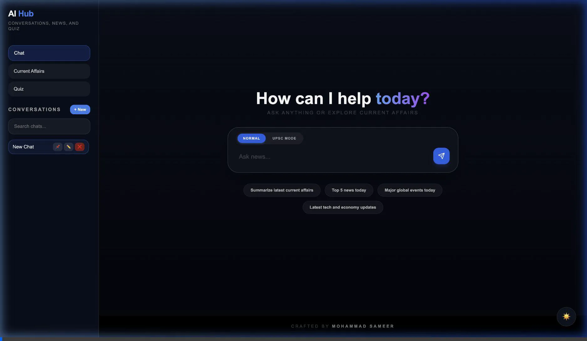

# 🚀 AI Hub
### Conversations • Current Affairs • Quiz — All in One AI Platform

<p align="center">
  
  
  
  
  
</p>

## 🌐 Live Demo

*   **👉 Frontend:** [https://ai-hub-rust.vercel.app](https://ai-hub-rust.vercel.app)
*   **👉 Backend:** [https://ai-hub-aqyl.onrender.com](https://ai-hub-aqyl.onrender.com)

---

## 🎬 Demo
<p align="center">
  
</p>

---

## 🖼️ UI Preview

### 💬 Chat Interface
<p align="center">
  
</p>

### 📰 Current Affairs
<p align="center">
  
</p>

### 🧠 Quiz Mode
<p align="center">
  
</p>

---

## ✨ Features

### 💬 Chat Mode
*   **AI-powered assistant** for natural conversations.
*   **Multi-model fallback** (Groq, Gemini, etc.) for high reliability.
*   **Graceful error handling** for API failures and quota exhaustion.

### 📰 Current Affairs
*   **Real-time news fetching** from multiple global providers.
*   **Categorized insights** (Politics, Economy, Tech, etc.).
*   **UPSC-focused summaries** for competitive exam preparation.

### 🧠 Quiz Mode
*   **Timer-based questions** to simulate exam pressure.
*   **Difficulty levels** (Easy, Medium, Hard).
*   **Interactive UI** with instant feedback and result tracking.

---

## 🧠 Architecture
<p align="center">
  
</p>

---

## 🏗️ Tech Stack

| Component | Technologies |
| :--- | :--- |
| **Frontend** | React (Vite), Tailwind CSS, Framer Motion, Axios |
| **Backend** | FastAPI, Uvicorn, Python, Modular Service Architecture |
| **AI & APIs** | Groq API, Gemini API, NewsAPI, GNews, NewsData |
| **Deployment** | Vercel (Frontend), Render (Backend) |

---

## 📁 Project Structure
```text
ai-hub/
├── frontend/        # React + Vite application
├── backend/         # FastAPI backend
│   ├── app/
│   │   ├── routes/    # API endpoints
│   │   ├── services/  # Business logic & AI clients
│   │   └── main.py    # Entry point
│   └── requirements.txt
├── render.yaml      # Render deployment config
└── DEPLOYMENT.md    # Step-by-step deployment guide
```

---

## ⚙️ Environment Setup

### Backend (.env)
```bash
GROQ_API_KEY=
GEMINI_API_KEY=
NEWS_API_KEY=
NEWSDATA_API_KEY=
MISTRAL_API_KEY=
TOGETHER_API_KEY=
NVIDIA_API_KEY=

CORS_ORIGINS=https://ai-hub-rust.vercel.app
```

### Frontend (.env)
```bash
VITE_API_BASE_URL=https://ai-hub-aqyl.onrender.com
```

---

## ⚡ Engineering Highlights
*   **Lazy AI Client Initialization:** Prevents crashes and slow startup by only initializing models when needed.
*   **Multi-Provider Fallback:** Ensures 99.9% uptime by switching providers if one fails.
*   **Dynamic CORS:** Seamlessly handles cross-origin requests between Vercel and Render.
*   **Modular Backend:** Clean separation of concerns for easier scalability and maintenance.

---

## 🧨 Challenges Solved
*   **CORS issues:** Resolved communication hurdles between Vercel and FastAPI.
*   **API rate limiting:** Implemented smart caching and fallback mechanisms.
*   **Dependency conflicts:** Fixed `lxml_html_clean` and other library issues for cloud deployment.
*   **Import-time crashes:** Moved heavy imports inside functions to stabilize the server.

---

## 📈 Future Improvements
*   [ ] Authentication system for personalized experience.
*   [ ] Chat history persistence using a database.
*   [ ] Streaming responses for a more natural chat feel.
*   [ ] Enhanced mobile optimization.
*   [ ] Usage tracking and analytics dashboard.

---

## 👨‍💻 Author

**Mohammad Sameer**
🔗 [https://github.com/MSameer7-tech](https://github.com/MSameer7-tech)

---

## ⭐ Show Some Love

If you found this project useful:
*   ⭐ **Star** the repo
*   🍴 **Fork** it
*   🚀 **Build** on top of it
